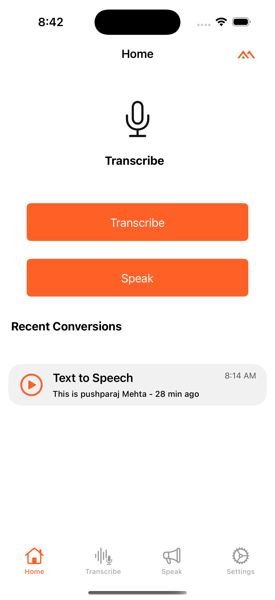
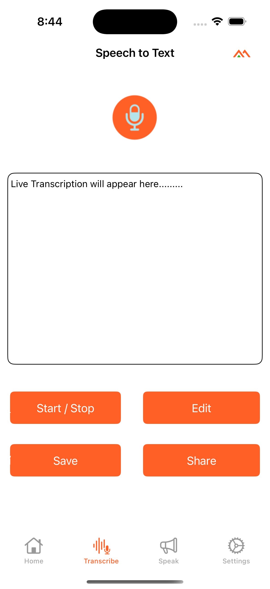
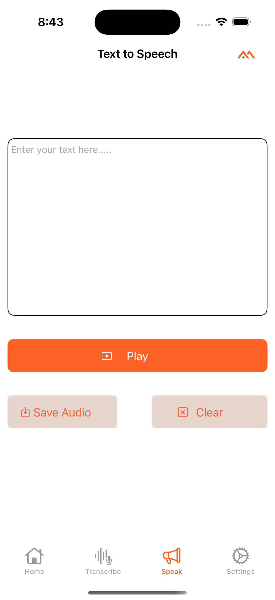
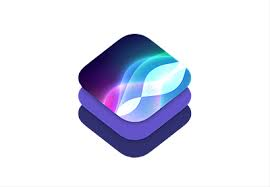

# Transcribe

 <!-- Replace with your app's logo URL -->

## Overview

**Transcribe** is an innovative iOS application that allows users to convert speech to text and vice versa. It is designed to enhance accessibility by providing high-quality speech synthesis and transcription capabilities. Users can easily generate text from spoken words, edit the transcribed text, and save it for future use. The app also includes customizable settings to tailor the user experience, making it a versatile tool for various applications.

## Screenshots






## Features

- **Text-to-Speech:** Converts user-input text into synthesized speech using customizable voice settings, including speed and pitch.
- **Speech-to-Text:** Transcribes spoken words into editable text.
- **Text Editing:** Allows users to edit the transcribed text before saving.
- **Save Functionality:** Users can save both the synthesized speech and transcribed text for future reference.
- **Audio Playback:** Provides functionalities to play, pause, and resume audio playback.
- **Settings Management:** Includes various settings controllers to customize user preferences.
  - 
  - **Language Preference:** Choose preferred languages for speech synthesis and transcription.
  - **Voice Preference:** Select different voices for speech output.
  - **History Management:** Manage and review previous transcriptions and saved audio.
  - **Data Privacy:** Set data privacy preferences for the application.
  - **Sound Settings:** Customize sound alerts and playback settings.
  - **Appearance Settings:** Adjust the app's visual theme.
  - **Notifications:** Configure notification preferences.
  - **About:** Information about the app and its developers.
  - **Feedback:** Provide user feedback for app improvement.
- **User Alerts:** Notifies users about successful actions, such as saving audio or transcription.

## Technologies Used

- **Programming Language:** Swift  


- **Frameworks:**  
  - **UIKit**  
    

  - **AVFoundation**  
  For speech synthesis and audio management.  
    

  - **Speech**  
  For speech recognition and handling voice input.  
  

- **Development Environment:** Xcode  


## Installation

1. Clone the repository:
   ```bash
   git clone https://github.com/Pushparaj13811/transcrib.git


2. Open the project in Xcode:
   - Navigate to the cloned directory and open `Transcribe.xcodeproj`.

3. Run the app:
   - Select a simulator or connect your iOS device.
   - Click on the **Run** button in Xcode.

4. [Download link to App Store](#)

## Usage

1. **Text-to-Speech:**
   - Enter the text you wish to convert to speech in the provided text view.
   - Click the **Play** button to start the speech synthesis.

2. **Speech-to-Text:**
   - Tap on the **Microphone** button to start speech recognition.
   - Speak clearly, and the app will transcribe your speech into text.

3. **Edit Text:**
   - After transcription, you can edit the text as needed.

4. **Save Audio & Text:**
   - Click the **Save Audio** button to save the synthesized speech as an audio file.
   - Use the **Save Text** option to save the edited text.

5. **Access Settings:**
   - Navigate to the settings section to customize language, voice, appearance, and more.

6. **Check Saved Files:** The saved audio files and transcriptions will be stored in the app's documents directory.

## Code Structure

The main components of the project are:

- **View Controllers:**
  - **ViewController:** The main controller managing user interactions and displaying the main features of the app.
  - **TextToSpeechViewController:** Handles the text-to-speech functionality.
  - **SpeechToTextViewController:** Manages speech recognition and transcription.
  - **AudioPlayerViewController:** Manages audio playback features.
  - **SettingViewController:** Acts as the container for all settings view controllers.
  - **LanguagePreferenceViewController:** Manages language preferences.
  - **VoicePreferenceViewController:** Allows users to select different voices for speech synthesis.
  - **HistoryManagementViewController:** Handles the review and management of saved transcriptions and audio files.
  - **DataPrivacyViewController:** Manages user data privacy settings.
  - **SoundSettingViewController:** Customizes sound and playback settings.
  - **AppearanceSettingViewController:** Adjusts the app's visual theme.
  - **NotificationsViewController:** Configures notification settings.
  - **AboutViewController:** Displays information about the app and its developers.
  - **FeedbackViewController:** Collects user feedback for improvements.

## Contributing

Contributions are welcome! If you would like to contribute to the project, please follow these steps:

1. Fork the repository.
2. Create a new branch (`git checkout -b feature/YourFeature`).
3. Commit your changes (`git commit -m 'Add some feature'`).
4. Push to the branch (`git push origin feature/YourFeature`).
5. Open a pull request.

## License

This project is licensed under the MIT License - see the [LICENSE](LICENSE) file for details.

## Acknowledgments

- Thanks to Apple for providing the AVFoundation framework.
- Inspiration from various open-source speech synthesis and transcription projects.

## Contact

For any inquiries or issues, please contact me at [contact](mailto:pushparajmehta002@gmail.com) (mailto:saranshkaushik3@gmail.com) or open an issue on GitHub.
